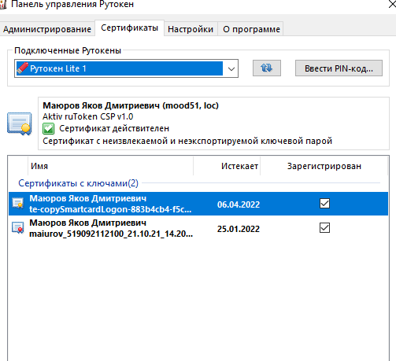
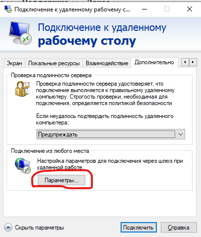
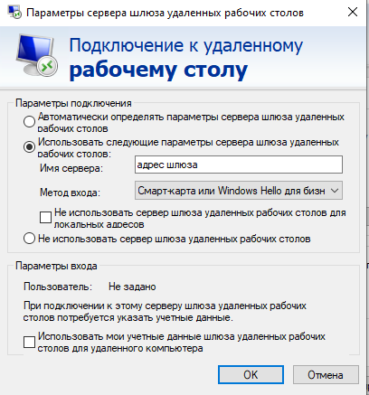

В данном файле описана процедура удаленного подключения из внешней сети к рабочему месту по протоколу RDP через шлюз удаленных рабочи столов
Из соображений инфорационной безопасности некоторые адреса скрыты.

Для установки подключения необходимо, чтобы были выполнены следующие уловия:

- Операционная система Windows, не ниже 7
- Авторизация на шлюзу удаленных рабочих столов осуществляется при помощи сертификата на смарт-карте
- Пользователь должен быть добавлен в группу безопасности RDSRouterGroupe
- Криптопровадйдер при помощи которого сгенерирован закрытый ключ, должен быть установлен на клиентском компьютере(пока используется Rutoken)
- Наличие актуальных обновлений ОС
- Актальное время на клиентском компьютере
- Актуальный срок дествия сертификата.

#### Термины:
Клиентский компьтер - компьтер, с которого устанавливается подключения (то, что дома)
\nКриптопровайдер -  это независимый модуль, позволяющий осуществлять криптографические операции в операционных системах Microsoft, управление которым происходит с помощью функций CryptoAPI
\nТокен - USB ключ, носитель закрытых ключей
####  Подготовка 
1. Убедиться в актуальности времени на клиентском компьтере
2. Установить криптопровадер rutoken [https://www.rutoken.ru/support/download/windows/](https://www.rutoken.ru/support/download/windows/)
3. Вставить токен в USB-порт, убедиться, что светодиод на нем горит
4. Открыть программу "Панель управления Рутокен", перейти на вкладку сертификаты:

5. Убеждаемся в том, срок действия сертификата актуален. Если нет - идем с токено в ИТ-кабинет.
6. Смотрим на галочку зрегесрирован в списке сертификатов, если галочка не установлена - поставить.

##### Необязательные действия:
Установить в локальное хранилище сертификатов сертификаты УЦ МООД в папки "Доверенные корневые центры сертифкации", "Доверительные отношения в организации".

#### Создание файла подключение
Для сохранения индивидуальных настроек подключения создаем RDP-файл:
1. Запускаем стандартный RDP-клиент Windows: либо ищем программу "Подклбючение к удаленному рабочему столу", либо сочетание клавиш Win+R и в открывшемся окне пишем mstsc и жмем Enter
2. В окне RDP-клиента нажимаем на кнопку "Показать параметры", идем на последнюю вкладку "Дополнительно", нажимаем на кнопку "Параметры..." в разделе "Подключение из любого места":

4. В открывшемся окне выставляем следующие параметры:
 - "Использовать следующие парметры сервера шлюза удаленных рабочих столов"
 - "Имя сервера": [адрес нашего шлюза]
 - Метод входа: смарт-карта или Windows Hello для бизнеса
 - Снять галочку "Не использовать сервер шлюза удаленных рабочих столов для локальных адресов"
 - Снять галочку "Использовать мои учетные данные шлюза удаленных рабочих столов для удаленного компьтера"

 - Нажимаем ОК
4. В окне RDP-клиента возвращаемся на вкладку "Общие". Указываем параметры подключения:
Компьтер - имя рабочей станции в Учреждении
Пользователь в формате имя домена\имя пользователя (можно не указывать на данном этапе, - запросит при подключении)
6. Жмем "Сохранить как", сохраняем файл в удобном месте с удобным именем.

#### Покдлючение:
1. Открываем сохраненный файл стандартным двойным щелчком. На экране может отобразиться запрос подтверждения, в котором можно поставить галочку, чтобы предупреждение больше не показывалось, и нажать Да
2. Запросятся учетные данные шлюза удаленных рабочих столов - выбираем свой сертификат, вводим пин-код токена
3. Следом заправшиваются учетные данные для подключения к компьютеру - вводим свой логин/пароль.
4. Могут отобразаиться предупреждении о недоверии центру сертифкации, - либо устанавкливаем сертификаты УЦ как написано выше, либо ставим галочку "Больше не предупреждать" и подтвеждаем подключение
5. Должен отобразиться удаленный рабочий стол

